**Note:** For the screenshots, you can store all of your answer images in the `answer-img` directory.

## Verify the monitoring installation

*TODO:* run `kubectl` command to show the running pods and services for all components. Take a screenshot of the output and include it here to verify the installation

```sh
kubectl get pods,svc -n monitoring 
```
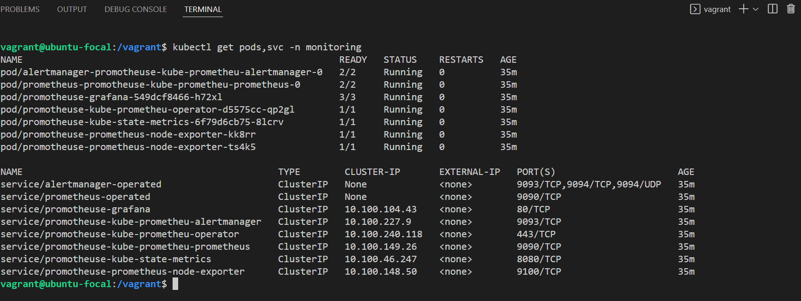

## Setup the Jaeger and Prometheus source
*TODO:* Expose Grafana to the internet and then setup Prometheus as a data source. Provide a screenshot of the home page after logging into Grafana.

```sh
kubectl port-forward service/prometheus-grafana --address 0.0.0.0 3000:80 -n monitoring
```
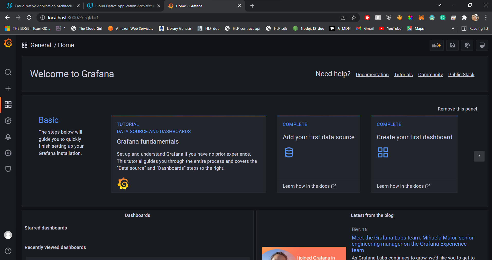

## Create a Basic Dashboard
*TODO:* Create a dashboard in Grafana that shows Prometheus as a source. Take a screenshot and include it here.

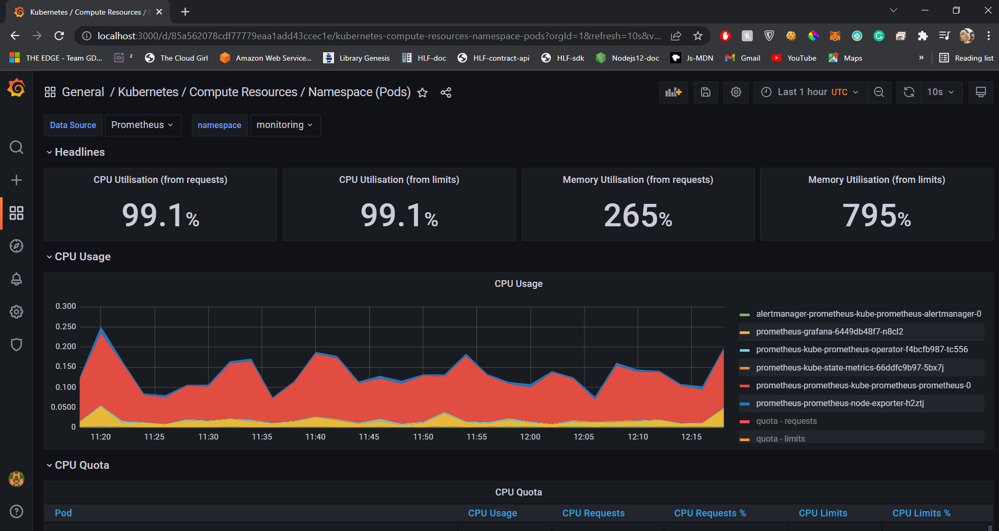

## Describe SLO/SLI
*TODO:* Describe, in your own words, what the SLIs are, based on an SLO of *monthly uptime* and *request response time*.

In general, SLI or Service Level indicature is a measurement of the metrics that are stated by an SLO , to showcase how much the objective defined in SLO is met.

For *monthly uptime* the SLI can be expressed by the real time of the software application being online or responsive in a given month. It can be expressed as a pourcentage. 

For *request-response time* the SLI can be expressed as the real  time that takes a request to be served from end to end in average in a given period of time; 

## Creating SLI metrics.
*TODO:* It is important to know why we want to measure certain metrics for our customer. Describe in detail 5 metrics to measure these SLIs. 

1) **Latency** : It is critical for a system to know [The proportion of valid requests served faster than a threshold.](https://cloud.google.com/architecture/adopting-slos). Thus a good metrics to measure time per request is the number of HTTP 200 requests within 300 ms for 28 days. 
2) **Traffic**  : It is also vital for a system to track the demand on the system in terms of number of HTTP requests per seconds for 28 days. Traffic is a good metrics that showcase usability of system from customer base.
3) **Errors** : To contrast with traffic it is important to know out of usual number of requests that the system received , the number of requests that are failing with HTTP 500 in 28 days window.
4) **Saturation** : It is also critical from the system point of view to know how much traffic it can serves with regards to its limits such as CPU and memory. A good metrics to measure how full the system is to track % of CPU and Memory Utimization winthin 28 days.
5) **Availability** :  It is also useful for a system to know [The proportion of valid requests served successfully.](https://cloud.google.com/architecture/adopting-slos) . A good mesure for that we can show the percentage of successful request HTTP 200 per oppose to failed request HTTP 500 aggregated each 10 minutes for 28 days.

## Create a Dashboard to measure our SLIs
*TODO:* Create a dashboard to measure the uptime of the frontend and backend services We will also want to measure to measure 40x and 50x errors. Create a dashboard that show these values over a 24 hour period and take a screenshot.

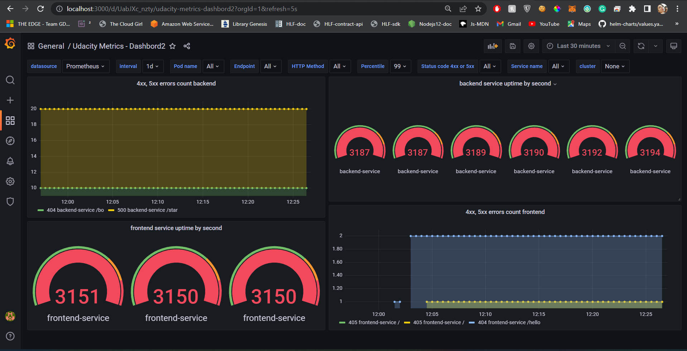

## Tracing our Flask App
*TODO:*  We will create a Jaeger span to measure the processes on the backend. Once you fill in the span, provide a screenshot of it here. Also provide a (screenshot) sample Python file containing a trace and span code used to perform Jaeger traces on the backend service.

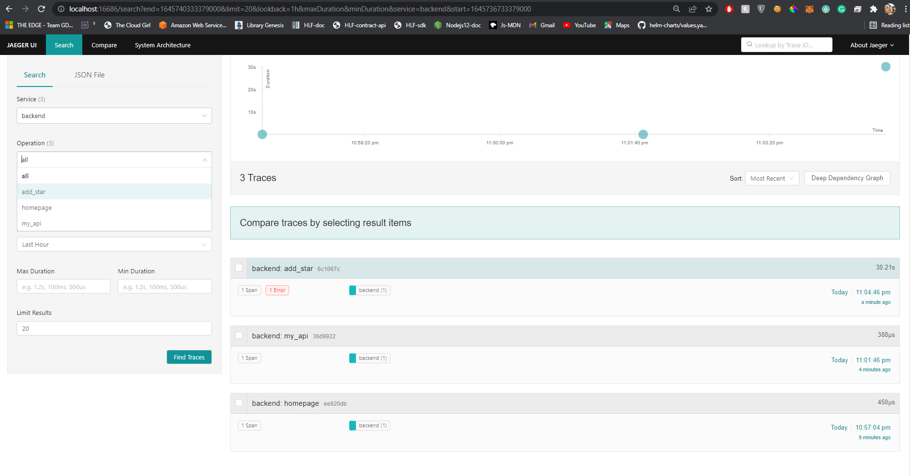
<p align="center">
    spans to measure processes in backend
</p>

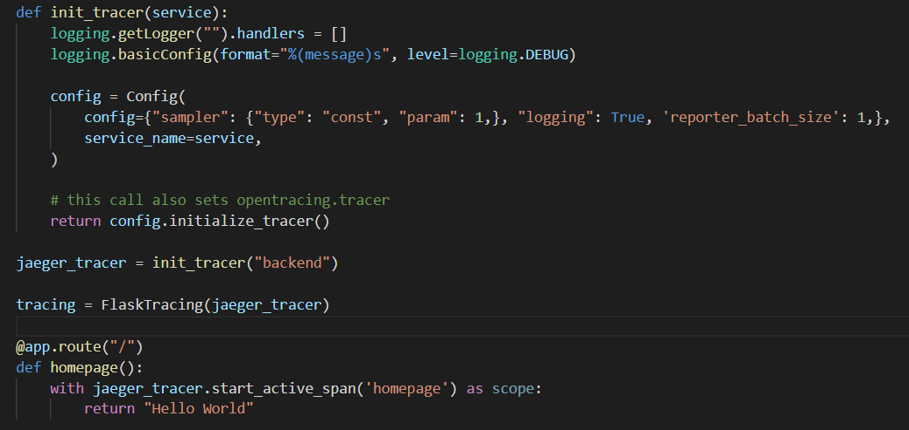
<p align="center">
    sample python trace & span in backend
</p>

## Jaeger in Dashboards
*TODO:* Now that the trace is running, let's add the metric to our current Grafana dashboard. Once this is completed, provide a screenshot of it here.

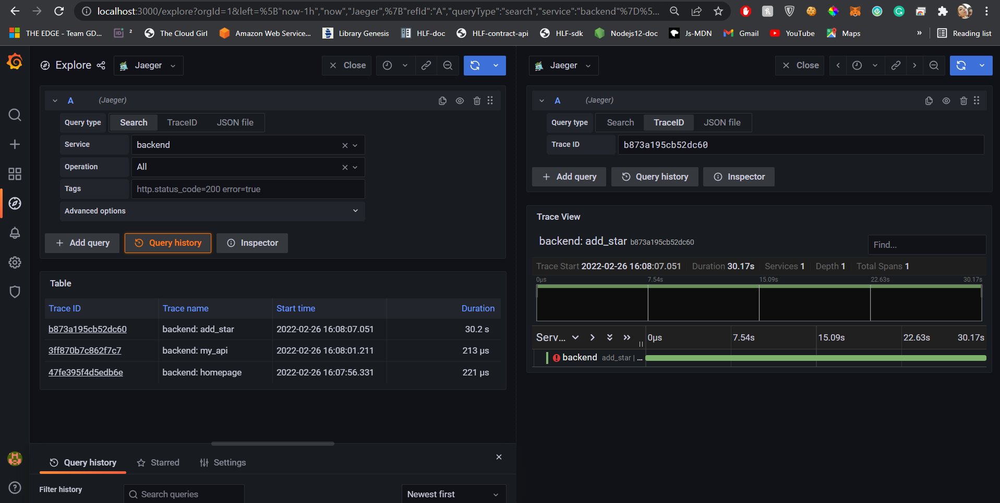

## Report Error
*TODO:* Using the template below, write a trouble ticket for the developers, to explain the errors that you are seeing (400, 500, latency) and to let them know the file that is causing the issue also include a screenshot of the tracer span to demonstrate how we can user a tracer to locate errors easily.

TROUBLE TICKET

Name: Internal Server Error in Backend Service for the /star endpoint 

Date: 5/6/2022

Subject: Internal Server Error in Backend related to MongoDB connectivity 

Affected Area: /star endpoint in the 

Severity: High

Description: MongoDB configuration is incorrect leading to it being unreachable by the backend application . Kubernetes manifests and networking between mongodb service and backend service needs to be investigated? 


## Creating SLIs and SLOs
*TODO:* We want to create an SLO guaranteeing that our application has a 99.95% uptime per month. Name four SLIs that you would use to measure the success of this SLO.

**SLI**
1. Percentage of CPU and Memory Used in the last two weeks ( Saturation ) is 80%
2. Services Uptime is increasing in seconds ( Availability)
3. Count of error messages per minutes is less than 20 ( Error Budget)
4. HTTP request per Second is 0.000500 ( Traffic )


## Building KPIs for our plan
*TODO*: Now that we have our SLIs and SLOs, create a list of 2-3 KPIs to accurately measure these metrics as well as a description of why those KPIs were chosen. We will make a dashboard for this, but first write them down here.
1. Error Budget
2. Uptime
3. Latency 
4. Saturation 

## Final Dashboard
*TODO*: Create a Dashboard containing graphs that capture all the metrics of your KPIs and adequately representing your SLIs and SLOs. Include a screenshot of the dashboard here, and write a text description of what graphs are represented in the dashboard.  

For an SLO of 99.95% Uptime per Months ; we have chosen to represents to following SLIs 

1. **`4xx and 5xx errors counts for backend and frontend service in each minutes everyday.`**

we can aggregate the results and count their percentatge from the total number of HTTP request to measure our KPI for Error Budget 

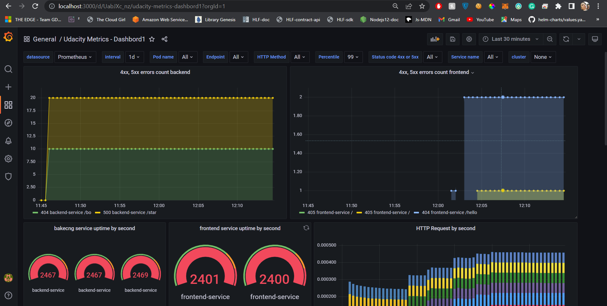

2. **``frontend and backend service uptime in seconds everyday.``** 

we can aggregate the results for 30 days which gives us a measure our uptime KPI uptime percentage against the downtime per month 
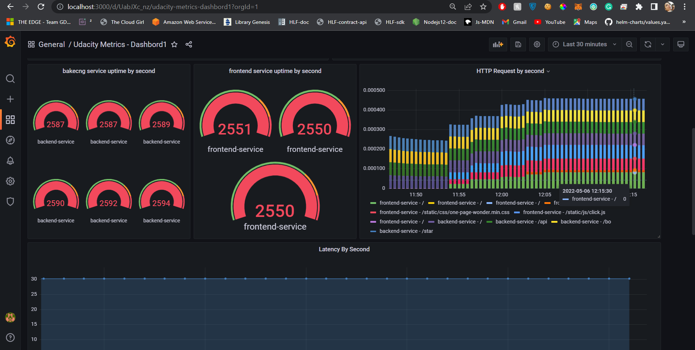

3. **`Latency by second`** 

we can calculate the time taken by the requests to be served by their number to measure the average time for the requests to be completed indicating the Latency KPI 
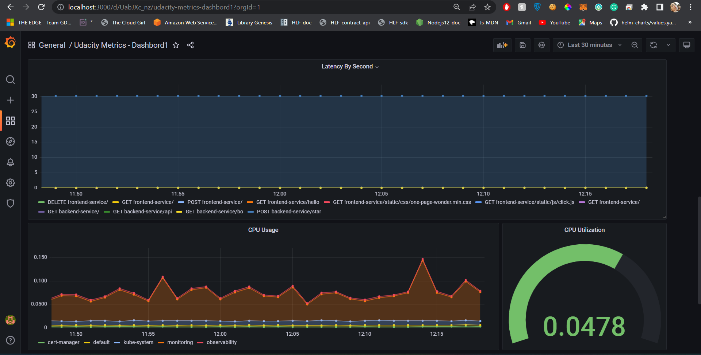

4. **``CPU and Memory Utilization by namespace by minutes``**

We can calculate the usage of CPU and memory in the default namespace per minute and aggregate the results to have CPU and memory utilisation per months.
This measure can give us a clear indication on Saturation KPI

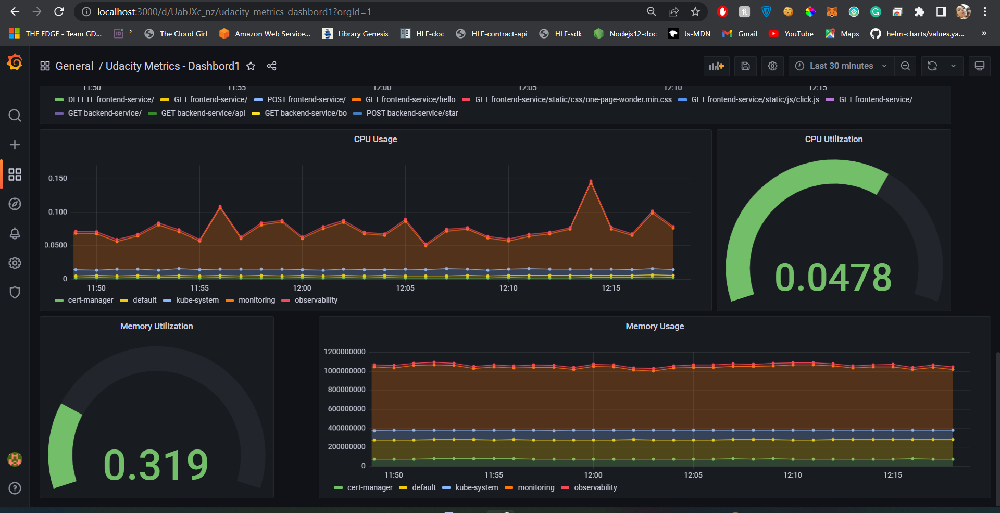


